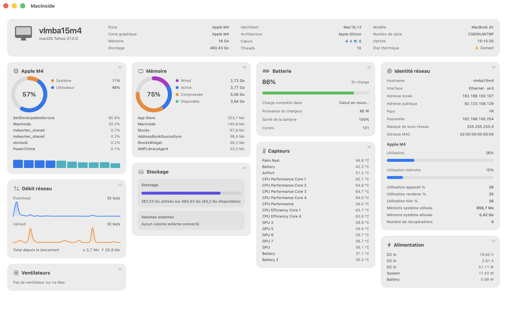
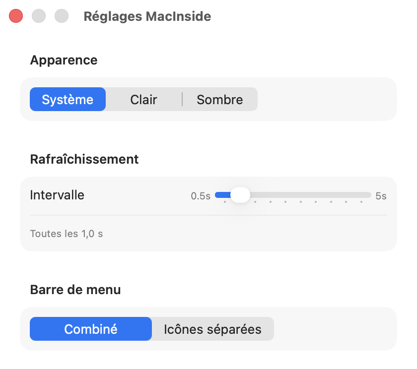

<div align="center">

# MacInside

**A native macOS system dashboard — window + menu bar, iStat Menus/Stats style.**

Real-time CPU, memory, storage, network, hardware sensors, GPU and battery — in a masonry dashboard window and a fully customizable menu bar.

[](https://www.apple.com/macos)
[](https://github.com/vincentlauriat/MacInside/releases/latest)
[](https://swift.org)
[](https://developer.apple.com/swiftui)
[](#)
[](#license)

</div>

---



## Why

macOS shows you Activity Monitor for processes, System Settings for battery health, and nothing at all for fan speeds or SMC temperatures. MacInside puts all of it — machine identity, CPU, memory, storage, network, hardware sensors, GPU and battery — on one real-time dashboard, with a menu bar that mirrors as much or as little of it as you want.

It talks directly to `host_statistics`, IOKit's `AppleSMC`, `IOAccelerator` and `libproc` — no shell-outs to `top`/`iostat`, no third-party daemon.

## Features

| | |
| --- | --- |
| 🖥️ **Machine identity** | Model, chip, OS version, serial number, uptime, thermal state |
| ⚡ **CPU** | System/user load, performance vs. efficiency core bars, top processes |
| 🧠 **Memory** | Wired/active/compressed/available ring, top processes by memory |
| 💾 **Storage** | System volume + external volumes, used/available |
| 🌐 **Network** | Local/public IP, country, gateway, subnet, MAC address, live down/up sparklines |
| 🌡️ **Sensors** | Real SMC temperature & fan readings (Intel and Apple Silicon), with an explicit "no fan on this Mac" state for fanless models |
| 🔌 **Power** | Voltage/current/wattage readings (DC In, system, battery) where available |
| 🎮 **GPU** | Device/renderer/tiler utilization, memory in use, via `IOAccelerator` |
| 🔋 **Battery** | Charge %, time remaining, health, cycle count — hidden automatically on desktop Macs |
| 🧩 **Drag-to-reorder dashboard** | Reorder cards by dragging them; the layout persists across launches |
| 📊 **Menu bar, two modes** | One combined dropdown, or a separate icon per metric (CPU/Memory/Network/Disk/Battery/GPU), each with its own detailed dropdown |
| 🌍 **Localized FR/EN** | Follows the system language automatically |
| 🚀 **Auto-update** | Sparkle 2 + notarized DMGs + EdDSA signature — *Check for Updates…* prompts before downloading, never installs silently |

## Screenshots

| Dashboard | Settings |
| --- | --- |
|  |  |

## Install

Grab the latest pre-built `.dmg` from the [GitHub Releases page](https://github.com/vincentlauriat/MacInside/releases/latest), mount it, and drag `MacInside.app` to `/Applications`.

Releases are signed with an Apple Developer ID, built with the Hardened Runtime, and notarized + stapled by Apple — they launch by double-click without any Gatekeeper warning, even offline. **Sparkle** then takes over: every future release is offered automatically via *MacInside → Check for Updates…*, downloaded and installed only after you confirm.

> App Sandbox is disabled (`MacInside/MacInside.entitlements`): reading SMC sensors and enumerating processes are not sandbox-compatible. Distribution is Developer ID + notarization, not the Mac App Store.

## Build from source

**Requirements:** Xcode 15+, [XcodeGen](https://github.com/yonaskolb/XcodeGen) (`brew install xcodegen`).

```bash
xcodegen generate          # generates MacInside.xcodeproj
open MacInside.xcodeproj   # scheme MacInside
```

## Release (macOS)

```bash
./Scripts/release.sh 1.0.0   # build → sign Developer ID → DMG → notarize → staple → Sparkle-sign → appcast.xml
```

## Project layout

```
MacInside/
├── MacInsideApp.swift        # @main — WindowGroup (dashboard) + MenuBarExtra + Settings + Sparkle updater
├── AppModel.swift            # provider aggregation, refresh loop
├── Formatters.swift          # bytes/percentage/uptime/temperature formatting
├── Localizable.xcstrings     # String Catalog (FR source, EN translations)
├── Models/Metrics.swift      # data structs (CPUStats, MemoryStats, ...)
├── Providers/                # low-level system access (host_statistics, IOKit, SMC, libproc...)
├── Settings/AppSettings.swift
├── Views/                    # DashboardView + cards (CPU, Memory, Network, Sensors...)
├── Views/Components/         # gauge ring, sparklines, reusable card
└── MenuBar/                  # menu bar icon + dropdown content
Scripts/                      # release.sh, make-app-icon.swift, make-dmg-background.swift
project.yml                   # XcodeGen config
appcast.xml                   # Sparkle update feed
```

## License

MIT — see [`LICENSE`](LICENSE).
